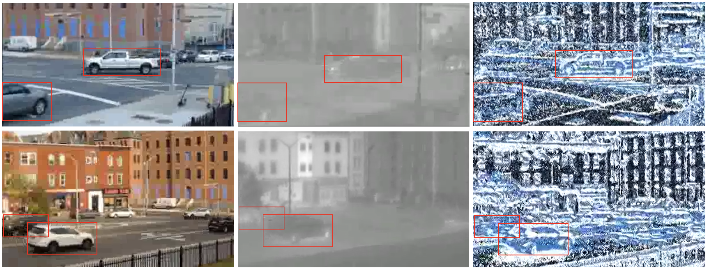

# RGB, Thermal, and Event Data Fusion for UAV-Based Object Detection

  
  

## Introduction

This repository contains the code and dataset for our paper:

**RGB, Thermal, and Event Data Fusion for UAV-Based Object Detection**  

> *Abstract*:  
> This paper presents a UAV-based object detection system that fuses RGB, thermal, and event camera data to enhance detection capabilities. The hardware setup includes synchronized RGB, thermal, and event cameras in a custom housing, mounted on an enterprise-grade UAV. Multi-modal data alignment is addressed through calibration and image registration. Deep neural network architectures—including CNNs, ResNets, Vision Transformers, and Swin Transformers—are adapted to process five-channel inputs corresponding to the fused modalities. Early, late, and hybrid fusion were investigated systematically using data obtained from flight tests conducted in an urban airspace. Results demonstrate that hybrid fusion at intermediate network layers demonstrates superior detection performance compared to early and late-stage fusion.

## Dataset

The dataset is available for download:  
[Download Dataset](https://drive.google.com/drive/folders/1XxtTAF0ECtn7rP2ZZYUNSPIgzEoSoCw8)

## Installation

### Prerequisites
- Python 3.8+
- PyTorch 1.10+
- CUDA 11.1+ (for GPU support)

### Steps
1. Clone the repository:  
   `git clone https://github.com/cvpr2025hybrid/uav-multimodal-detection.git`  
   `cd uav-multimodal-detection`

2. Create a virtual environment:  
   `python -m venv venv`  
   `source venv/bin/activate` (On Windows use `venv\Scripts\activate`)

3. Install required packages:  
   `pip install -r requirements.txt`

## Usage

### Training
The repository contains implementations for different fusion strategies and architectures:

#### CNN Models
   `python cnn/early_cnn.py`
   `python cnn/mid_cnn.py`
   `python cnn/late_cnn.py`
   `python cnn/search_cnn.py`

#### ResNet-50 Models
   `python resnet/early_resnet50.py`
   `python resnet/mid_resnet50.py`
   `python resnet/late_resnet50.py`
   `python resnet/search_resnet50.py`

#### Vision Transformer (ViT) Models
`python vit/early_vit.py`
`python vit/mid_vit.py`
`python vit/late_vit.py`
`python vit/search_vit.py`

#### Swin Transformer Models
`python swin/early_vit.py`
`python swin/mid_vit.py`
`python swin/late_vit.py`
`python swin/search_vit.py`

## Results

Our experiments show that hybrid fusion outperforms early and late fusion strategies across various architectures.

| Architecture | Fusion Strategy | mAP (%) |
|--------------|-----------------|---------|
| CNN          | Hybrid Fusion   | 70.4    |
| ResNet-50    | Hybrid Fusion   | **72.8**|
| ViT          | Hybrid Fusion   | 64.2    |
| Swin         | Hybrid Fusion   | 65.1    |

For detailed results and analysis, refer to the results section.

## Model Architectures

The repository includes implementations for:
- **CNNs**: Basic convolutional neural networks
- **ResNet-50**: Deep residual networks
- **Vision Transformers (ViT)**: Transformer-based vision models
- **Swin Transformers**: Hierarchical vision transformers

Each architecture is implemented with three fusion strategies:
- Early Fusion: Concatenation at input
- Mid/Hybrid Fusion: Feature fusion at intermediate layers
- Late Fusion: Decision-level fusion
